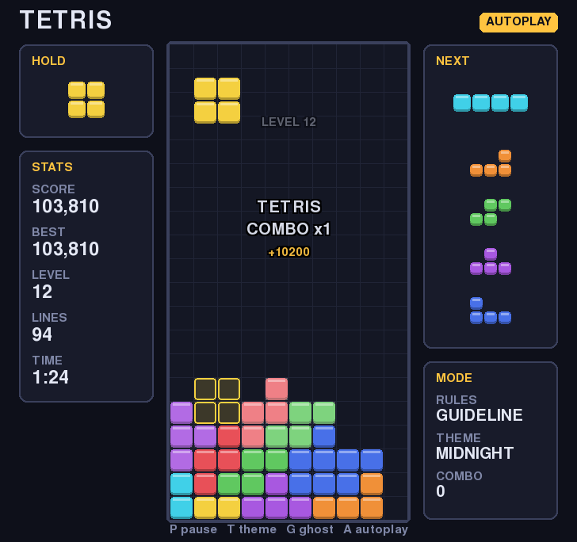

# tetris-pygame

A modern take on Tetris, written in Python with pygame. It keeps the familiar loop of falling tetrominoes and cleared lines, adds modern guideline rules (SRS rotation, a 7-bag randomiser, hold, ghost piece, T-spins), and puts a few of my own touches on top. I also wanted the code to be easy to learn from: the game rules are plain Python with no pygame imports, so you can read, test or reuse them on their own, and a thin pygame layer handles the window, input and drawing.



*A frame rendered headlessly by `scripts/screenshot.py`: the autoplayer has just scored a Tetris on a combo. You can see the ghost piece, the hold slot and the five-piece preview.*

## Features

**Classic mechanics, modern rules**

- 7-bag randomiser: each run of seven pieces contains every tetromino once, so you never wait more than 12 pieces for an I.
- Super Rotation System (SRS), including the full wall-kick and floor-kick tables, with a separate table for the I piece.
- A ghost piece, a hold slot (usable once per piece) and a five-piece next queue.
- Soft drop (20x gravity, 1 point per row) and hard drop (2 points per row).
- A lock delay of 0.5 s. Moving or rotating a grounded piece restarts the timer up to 15 times, and the count refills whenever the piece reaches a new lowest row.
- Levels go up every 10 lines and follow the guideline gravity curve, from 1 row per second at level 1 to near-instant drops by level 15.
- Guideline scoring: singles to Tetrises, full and mini T-spins (three-corner rule), a 1.5x back-to-back bonus and combo points.
- Line clears flash briefly before the rows collapse. Pause, game-over and title screens are included.
- A persistent top-five high-score table stored in `highscores.json`, which is gitignored.

**The personal spin**

- **Smoother movement.** Sideways movement uses its own DAS/ARR timing (167 ms delay, then one column every 33 ms) rather than the operating system's key repeat, so held keys feel the same on every machine. Falling pieces glide between rows instead of jumping, and a resting piece brightens as its lock timer runs out.
- **Callouts.** Clears show a short popup such as `BACK-TO-BACK / T-SPIN DOUBLE / COMBO x2 / +1900`. Level-ups get one too.
- **Colour themes.** Press `T` to cycle through Midnight, Pastel, Handheld and Neon at any time.
- **Swappable scoring rules.** `--scoring classic` switches to NES-style line values with no T-spin, combo or back-to-back bonuses.
- **Autoplay demo.** Press `A` to let a heuristic bot take over. It plays through the same controls you use. Games it touches are not added to the high-score table.
- **Auto-pause.** The game pauses when the window loses focus.

## Controls

| Key | Action |
| --- | --- |
| Left / Right | Move (hold to auto-repeat) |
| Down | Soft drop |
| Space | Hard drop |
| Up or X | Rotate clockwise |
| Z or Ctrl | Rotate anticlockwise |
| C or Shift | Hold |
| P or Esc | Pause / resume |
| R (while paused) | Restart |
| Q (while paused) | Quit |
| T | Next colour theme |
| G | Toggle ghost piece |
| A | Toggle autoplay |
| Enter | Start / play again |

Key bindings are tuples at the top of `tetris/app.py`, so changing one is a single edit.

## Project structure

```
tetris-pygame/
├── tetris/
│   ├── pieces.py       # Tetromino shapes, rotation states, SRS kick tables, Piece
│   ├── board.py        # Grid, collision and line clearing
│   ├── mechanics.py    # Pure movement rules: spawn, shift, rotate with kicks, T-spin check
│   ├── randomizer.py   # 7-bag piece generator
│   ├── scoring.py      # Scoring rule interface, guideline and classic rules, gravity curve
│   ├── game.py         # Game state machine: gravity, lock delay, hold, clears, events
│   ├── controls.py     # DAS/ARR auto-shift timing
│   ├── ai.py           # Heuristic autoplayer
│   ├── highscore.py    # JSON high-score table with atomic saves
│   ├── effects.py      # Popups and lock flashes derived from game events
│   ├── themes.py       # Colour themes (plain data)
│   ├── render.py       # All pygame drawing
│   └── app.py          # Window, event loop, key bindings, screens, CLI
├── tests/              # pytest suite (logic plus headless rendering)
├── scripts/screenshot.py
└── docs/screenshot.png
```

### How the pieces fit together

- **The rules never import pygame.** Everything above `render.py` and `app.py` in the list is plain Python. `Game` exposes control methods (`move`, `rotate`, `hard_drop`, `hold`, `set_soft_drop`) and a `tick(dt)` method that moves time forward. Because of this, the tests can script entire games without opening a window.
- **Movement rules are pure functions.** `mechanics.py` takes a board and a piece and returns a new piece or `None`. It never mutates anything. The game and the autoplayer both call these functions, so the bot cannot make a move that a player couldn't.
- **The game reports events instead of drawing them.** Locks, clears, level-ups and game over go into an event list. `effects.py` turns them into popups and flashes, which the renderer then draws. To add sound, you would write another event consumer.
- **Scoring is a strategy object.** Any class with `clear_points`, `soft_drop_points` and `hard_drop_points` will work. Register it in `SCORING_RULES` and it shows up as a `--scoring` option.
- **The SRS kick tables are written exactly as the reference publishes them** (y pointing up). They are converted once to screen coordinates, which keeps them easy to check against the source.

### The autoplayer

For the current piece, the bot tries every rotation followed by every column it can reach. It hard drops each candidate on a copy of the board and scores the result with four weighted features: aggregate height, lines cleared, holes and bumpiness. The weights come from Yiyuan Lee's genetic-algorithm-tuned player. The bot also scores the hold piece (or the next piece if the hold slot is empty) and holds when that scores better. It then plays the chosen placement one input at a time. At high levels it speeds its inputs up to stay inside a single gravity step.

## Tech stack

- Python 3.11+ (developed and tested on 3.14)
- [pygame-ce](https://pyga.me/) 2.5.8, the community edition of pygame. It uses the same `import pygame` API and ships Python 3.14 wheels, which the original `pygame` package does not yet provide.
- pytest for the tests

## Getting started

```bash
git clone https://github.com/Omith786/tetris-pygame.git
cd tetris-pygame
python3 -m venv .venv
source .venv/bin/activate
pip install -r requirements-dev.txt   # or requirements.txt if you only want to play
python -m tetris
```

Or use the Makefile: `make install`, then `make run`.

## Usage

```bash
python -m tetris                       # title screen, press Enter to play
python -m tetris --level 5             # start at level 5
python -m tetris --scoring classic     # NES-style scoring
python -m tetris --theme neon          # midnight, pastel, handheld or neon
python -m tetris --seed 42             # repeatable piece sequence
python -m tetris --autoplay            # watch the bot play (same as `make demo`)
python -m tetris --das 120 --arr 20    # snappier auto-shift, in milliseconds
python -m tetris --no-smooth           # draw falling pieces row by row
python -m tetris --highscores ~/tetris-scores.json
```

The high-score file defaults to `highscores.json` in the project root. You can also set it with the `TETRIS_HIGHSCORE_PATH` environment variable. If the file is missing or corrupt, the game starts with an empty table and does not crash.

## Testing

```bash
make test          # or: python -m pytest
```

The suite has 118 tests. Most cover the rules: piece shapes and kick tables, bag fairness, collision and line clears, wall and floor kicks, T-spin detection (full, mini and cancelled), guideline and classic scoring (including back-to-back and combos), gravity and lock-delay timing, hold, block-out and lock-out, and pause. Other tests cover DAS/ARR timing, the high-score store, the autoplayer (surviving 150 pieces, keeping up at level 15), and the pygame layer. That last group uses SDL's dummy video driver to render every screen in every theme and to drive the app with synthetic key presses.

Two headless checks exercise the real loop and renderer without opening a window:

```bash
make smoke         # runs the game loop for 300 frames with the autoplayer
make screenshot    # regenerates docs/screenshot.png
```

## Possible future work

- Sound effects and music, as another consumer of the game's events.
- An options screen for remapping keys, with saved preferences.
- Perfect-clear bonuses and a 180-degree rotation.
- Sprint (40 lines) and ultra (2 minutes) modes. `GameConfig` and the events already give most of what these need.
- Two-player versus mode with garbage lines, possibly against the autoplayer.
- A stronger bot using two-piece look-ahead or a learned evaluation.
